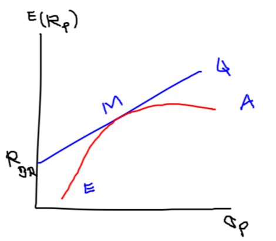
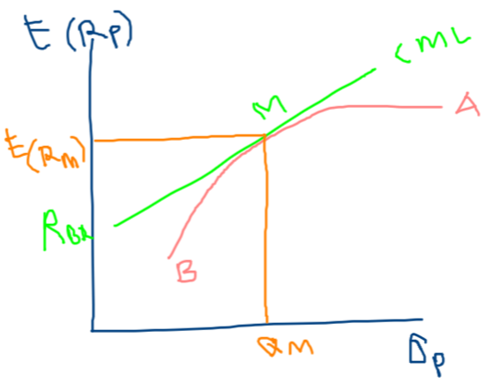
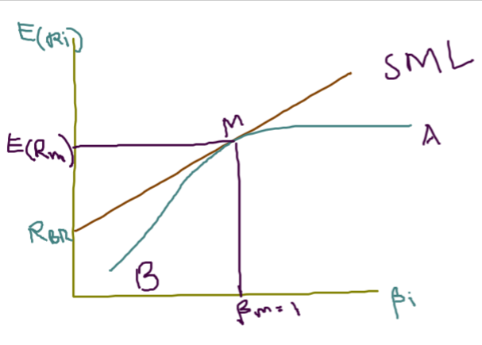

```{r setup, include=FALSE}
knitr::opts_chunk$set(
  echo = FALSE,
  R.options = list(width = 60)
)
```

## Pendahuluan

Modul ini membahas model-model keseimbangan dan beta ($\beta$) sebagai salah satu variabel peting di model keseimbangan. Model yang dibahas yaitu **CAPM**  dan **APT**. Setelah mempelajari modul ini, mahasiswa diharapkan mampu menerapkan konsep model-model keseimbangan dan beta aset tunggal dan portofolio. Secara khusus, mahasiswa diharapkan mampu:

1. menjelaskan pengertian CAPM.
2. menjelaskan asumsi-asumis yang digunakan di CAPM.
3. menjelaskan pengertian CML (*Capital Market Line*).
4. menjelaskan pengertian SML (*Security Market Line*).
5. menjelaskan penggunaan CAPM untuk analisis aset.
6. menerapkan model banyak faktor
7. menerapkan model pasar
8. menjelaskan konsep beta pasar sebagai pengukur risiko sistematik.
9. menjelaskan konsep beta portofolio.

<br />


## KEGIATAN BELAJAR 1: MODEL KESEIMBANGAN

### A. MODEL PENILAIAN ASET KAPITAL



### B. GARIS PASAR MODAL (GPM/CML)


$$E(R_p)= R_{BR} + \frac {E(R_M)-R_{BR} }{\sigma_m}.\sigma_p $$

### C. GARIS PASAR SEKURITAS (GPS/SML)



#### 1. CAPM untuk Aset Tunggal

$$ E(R_i) = R_{BR} + \beta_i [E(R_M)-R_{BR}]$$

#### 2. CAPM Tiga Faktor

$$ E(R_i) = R_{BR} + \beta_i [E(R_M)-R_{BR}] + b_sSMB + b_vHML$$

### D. ARBRITAGE PRICING THEORY

#### Model APT

$$ E(R_i) = a_0+ b_{i1} \bar F_1 + b_{i2} \bar F_2 + b_{i3} \bar F_3+ ...+b_{in} \bar F_n$$

## KEGIATAN BELAJAR 2: Beta

### A. PENGERTIAN BETA

### B. MENGESTIMASI BETA

--> Menggunakan teknik regresi, variabel dependennya return saham i dan variabel independennya adalah return pasar. 

$$ R_i = \alpha_i + \beta_i R_M + e_i$$

### C. BETA PORTOFOLIO

--> dihitung dengan cara rata-rata tertimbang dari masing-masing beta aset individual yang membentuk portofolio.

