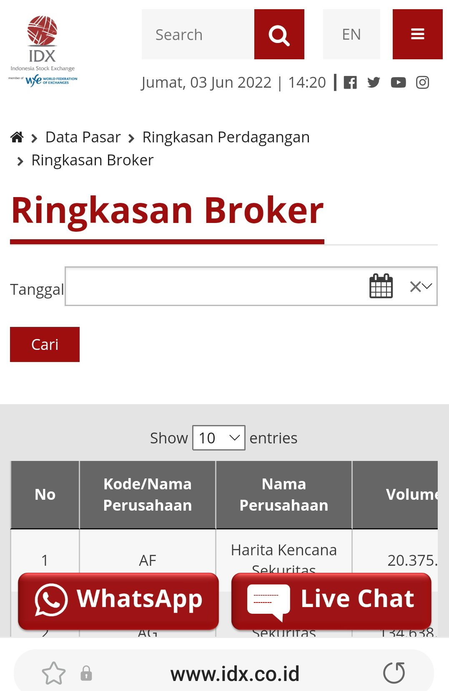
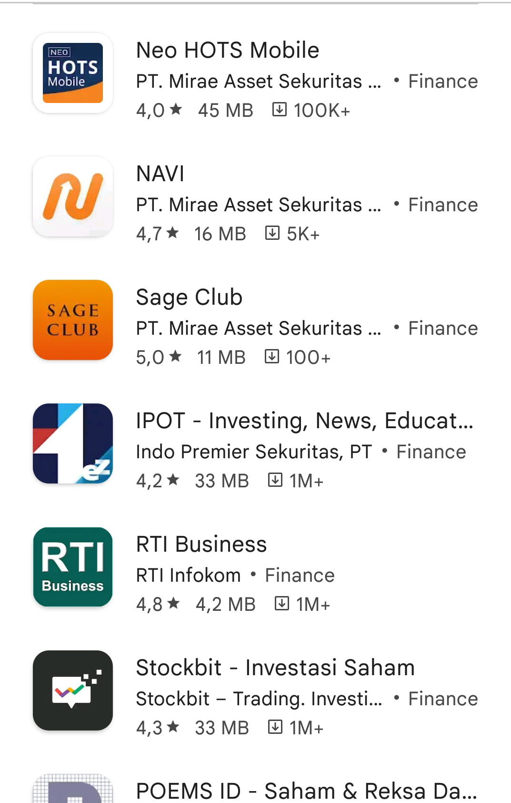
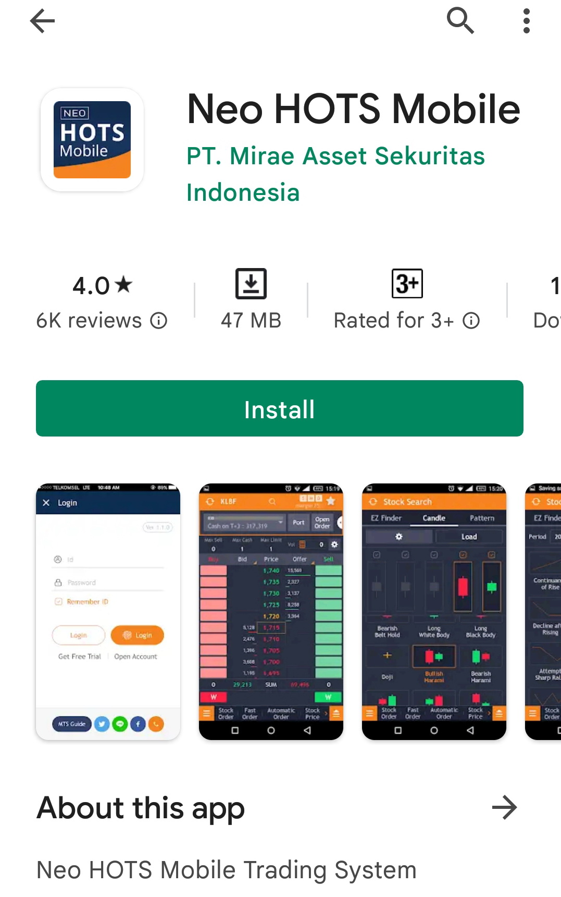
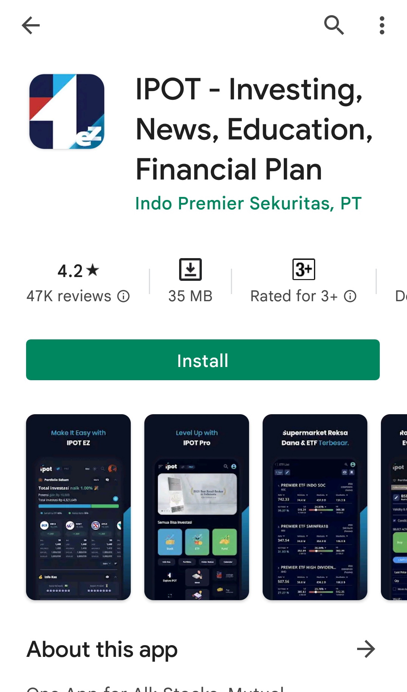

```{r setup, include=FALSE}
knitr::opts_chunk$set(echo = FALSE)
```

## Pendahuluan

Tutorial ini akan membahasa Modul 8 tentang *Online Trading*  dan Modul 9 tentang Membuat Sendiri Portofolio dan Investasi di Reksadana.

Setelah mempelajari Modul 8, mahasiswa diharapan mampu melakukan investasi transaksi aset tunggal secara *online* dengan *e-trading*. Secara khusus, modul ini mengharapkan mahasiswa mampu:

1. menjelaskan pengertian *e-trading*
2. menjelaskan cara memilih pialang
3. menjelaskan faktor-faktor penting yang perlu dipertimbangkan dalam pemilihan pialang di *e-trading*
4. menjelaskan persiapan awal yang dibutuhkan di transaksi *e-trading*
5. menggunakan aplikasi untuk melakukan transaksi di *e-trading*
6. menampilkan informasi saham di *e-trading*
7. melakukan pemesanan/order beli di *e-trading*
8. melakukan pemesanan/order jual di *e-trading*.

Sedangkan Modul 9 membahas mengenai pembuatan portofolio yang profesional baik yang digunakan sendiri ataupun dijual ke publik dalam bentuk reksadana. Setelah mempelajari Modul 9 ini, mahasiswa diharapkan mampu melakukan investasi dalam bentuk portofolio atau membeli reksadana yang tersedia di pasar. 

Secara khusus modul ini mengharapkan mahasiswa mampu:

1. menjelaskan cara mengeksekusi portofolio
2. menjelaskan cara mengeksekusi portofolio optimal sudut tertinggi
3. menjelaskan cara mengeksekusi portofolio risiko terkecil
4. menjelaskan pengertian reksadana
5. melakukan investasi dengan cara memilih reksadana berdasarkan kinerja retunrnya
6. melakukan investasi dengan cara memilih reksadana berdasarkan pengukur Sharpe (RVAR)
7. melakukan investasi dengan cara memilih reksadana berdasarkan pengukur Treynor (RVOL)
8. melakukan investasi dengan cara memilih reksadana berdasarkan pengukur Jogi (RDIV)
9. melakukan investasi dengan cara memilih reksadana berdasarkan pengukur Jensen (Jensen's Alpha)
10. melakukan investasi dengan cara memilih reksadana berdasarkan pengukur M^2.

## Modul 8: Online Trading

### KB 1: Mengenal Online Trading

#### ONLINE TRADING

- Jual beli saham, obligasi, reksadana dan *future* secara daring melalui pialang.
- Lebih efisien
- Komisi/fee lebih rendah

#### MEMILIH PIALANG

- Tercatat di BEI dan bersertifikat WPPE (Wakil Perantara Pedagang Efek)

- Reputasi --> lihat besar transaksi yang dilakukan
- Besar komisi

```{r out.width="50%"}

```

- Kemudahan dan keamanan app
- Kecepatan akses ke server pialang --> waktu adalah uang
- Pelayanan
- Dukungan purna jual

```{r out.width="50%"}

```

#### PERSIAPAN AWAL TRANSAKSI

- Dokumen pribadi
- Isi formulir
- Setor dana awal
- Unduh aplikasi sesuai broker yang dipilih di *Playstore, App Store* atau sesuai sistem operasi komputer yang digunakan

```{r out.width="50%"}

```

### KB 2: Menggunakan Online Trading

- *Update* dan/atau *upgrade* gadget dan app
- Gunakan kata sandi yang sulit dibongkar tapi mudah Anda ingat
- Ekplore fitur-fitur yang tersedia di aplikasi yang dipilih

```{r out.width="50%"}

```

<br />

```{r out.width="50%"}

```


## Modul 9: Membuat Sendiri Portofolio dan Investasi di Reksadana

### KB 1: Membuat Sendiri Portofolio

- Untuk digunakan sendiri atau dijual ke publik dalam bentuk reksadana
- Perhatikan risiko investor: tergantung umur, penghasilan, pengalaman, dll

### KB 2: Investasi Reksadana

- Reksadana: portofolio keuangan yang dibentuk oleh orang yang ahli yang dananya berasal dari investor pemodal

#### MACAM-MACAM REKSADANA

- Reksadana saham: >=80% aset saham
- Reksadana campuran: aset saham dan obligasi masing <80%
- Reksadana pendapatan tetap: >= 80% aset obligasi
- Reksadana pasar uang: >=80% aset pasar uang (BI repo atau deposito)

#### NIlai Aktiva Bersih (NAB): 

- harga reksadana setiap saatnya, mengikuti nilai dari aset-aset yang membentuk portofolio reksadananya

#### KINERJA REKSADANA

- Reward to Variability (Sharpe's Measure)

- Reward to Volatility (Treynor's Measure)

- Reward to Market Risk (RMAR)
- Reward to Diversification (RDIV)
- Pengukur M^2


